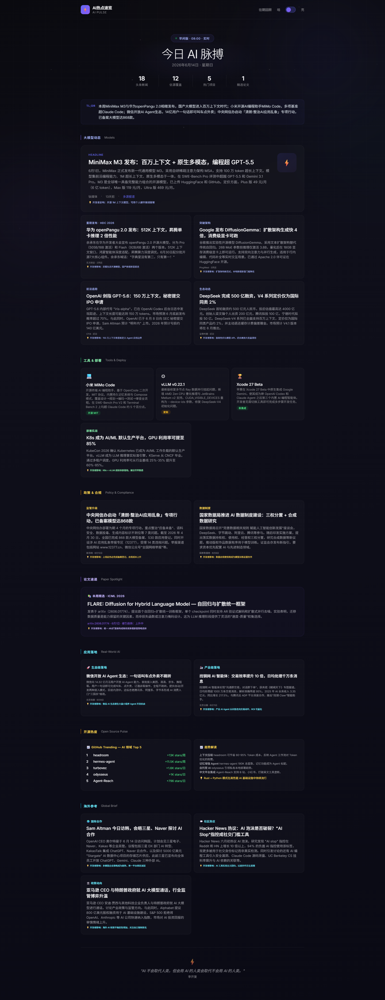
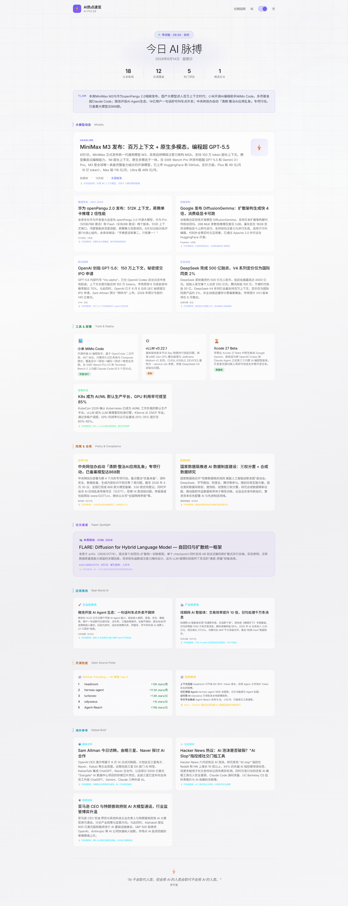

🌐 **言語を選択:** [English](README.en.md) · [中文](README.md) · [日本語](README.ja.md) · [Deutsch](README.de.md) · [한국어](README.ko.md)

<p align="center">
  
</p>

<h1 align="center">AI Pulse · 日次 AI ニュースダイジェスト</h1>

<p align="center">
  <em>AI 開発者のための日次ニュース自動集約。ゼロ依存。Claude Code ネイティブ。</em>
</p>

<p align="center">
  
  
  
</p>

---

**AI Pulse** は、[Claude Code](https://claude.ai) で動作する AI 開発者向け日次ニュース集約ページです。6 以上の情報源から 1 日 3 回自動でニュースを収集・整理し、美しい HTML ページを生成します。npm、Python、外部サービスは一切不要。Claude Code とターミナルだけで完結します。

## 機能

- 🤖 **7 つのセクション** — モデルアップデート、ツール & デプロイ、ポリシー & コンプライアンス、論文スポットライト、実世界の AI 事例、オープンソース動向、グローバルブリーフ
- ⚡ **4 段階の情報深度** — TL;DR(3秒) → 見出し(10秒) → 要約(30秒) → 全文
- 🎨 **Apple デザイン美学** — ダーク/ライトテーマ切替、動的アニメーション背景、ガラスモーフィズムカード
- 📱 **レスポンシブレイアウト** — デスクトップ、タブレット、モバイルで快適に表示
- 📅 **アーカイブカレンダー** — 過去のエディションをインタラクティブカレンダーで閲覧
- 🔍 **ゼロ依存** — 純粋な HTML/CSS/JS、ビルドツール不要
- 🇨🇳 **中国 AI エコシステム重視** — 中国国内モデルの動向とコンプライアンス情報を優先
- ⏰ **定期自動実行** — 毎日 07:49 / 12:17 / 20:13 に自動生成

## クイックスタート

```bash
# 1. リポジトリをクローン
git clone https://github.com/DaiOwen/ai-pulse.git
cd ai-pulse

# 2. 初号を生成
（Claude Code がプロジェクト設定を自動読込）
/ai-digest morning

# 3. ブラウザで index.html を開く
```

初回実行時、Claude Code は以下の処理を自動実行します：
- 6 以上の情報源から最新 AI ニュースを検索（WebSearch）
- トップ記事を詳細取得（WebFetch）
- 重複除去、スコアリング、翻訳、分類
- 完全な HTML を生成し `archive/` と `index.html` に保存

### 定期実行タスク

初回手動実行後、以下の 3 つのスケジュールタスクが自動登録されます：

| タスク | 時刻 | 対象範囲 |
|--------|------|----------|
| 🌅 朝刊 | 07:49 | 昨夜の海外 + 国内朝のニュース |
| ☀️ 昼刊 | 12:17 | 午前中の更新を差分反映 |
| 🌙 夕刊 | 20:13 | 終日サマリー + オープンソースデータ |

### 手動コマンド

| コマンド | 説明 |
|----------|------|
| `/ai-digest morning` | 朝刊を生成 |
| `/ai-digest noon` | 昼刊を生成（差分更新） |
| `/ai-digest evening` | 夕刊を生成（終日サマリー） |

## コンテンツセクション

| セクション | 説明 |
|------------|------|
| 🤖 モデルアップデート | 中国国内モデル優先 + 国際的な主要リリース |
| 🛠️ ツール & デプロイ | フレームワーク更新、ハードウェア適応、推論デプロイ |
| 📋 ポリシー & コンプライアンス | ネット情報弁公室（CAC）届出、AI 安全審査、業界標準 |
| 📄 論文スポットライト | 実用価値のある arXiv 論文を日替わりで厳選 |
| 💡 実世界の AI 事例 | 企業 AI 統合事例、ベストプラクティス |
| ⭐ オープンソース動向 | GitHub/Gitee Stars 上昇 Top 10 + 注目度 Top 10 |
| 🌍 グローバルブリーフ | 中国に影響を与える海外動向を 3 件厳選 |

## アーキテクチャ

```
Cron スケジュール (07:49 / 12:17 / 20:13)
       │
       ▼
Claude Code 起動
       │
       ├─ WebSearch（15-20 回の複数キーワード検索）
       ├─ WebFetch（上位 5-8 件を深堀り取得）
       └─ GitHub/Gitee API（オープンソース動向データ）
       │
       ▼
処理パイプライン
  ① 重複除去（タイトル類似度 + URL 正規化）
  ② スコアリング（人気×0.4 + 新規性×0.3 + 情報源品質×0.3）
  ③ 翻訳（海外ニュース → 中国語または英語要約）
  ④ 分類（7 セクション）
  ⑤ 要約生成（各 2-3 文 + 開発者影響度の注釈）
       │
       ▼
HTML 生成 & アーカイブ
  • 完全自己完結型 HTML を生成
  • archive/YYYY-MM-DD-{edition}.html に保存
  • index.html を最新版に更新
```

## プロジェクト構造

```
ai-pulse/
├── index.html              # メインページ（最新号 + カレンダーナビ）
├── archive/                # 履歴アーカイブ
│   └── YYYY-MM-DD-{edition}.html
├── assets/
│   └── favicon.svg         # サイトアイコン
├── design/                 # デザイン参考
├── .claude/                # Claude Code 設定
│   ├── settings.json       # 権限設定
│   └── scheduled_tasks.json # スケジュールタスク（実行時）
├── CLAUDE.md               # プロジェクト指示 + Skill 定義
├── .gitignore
└── README.md
```

## スクリーンショット

### 🌙 ダークモード（デフォルト）



### ☀️ ライトモード



## よくある質問（FAQ）

**Q: index.html が空白で表示されます。**
A: 初回は `/ai-digest morning` を実行してコンテンツを生成してください。

**Q: 過去のエディションを閲覧するには？**
A: 「アーカイブ」ボタンをクリックし、カレンダーモーダルから過去の日付と版を選択します。

**Q: 定期タスクが実行されません。**
A: ターミナルで `CronList` を実行してタスク状態を確認してください。Claude Code が起動していることを確認します。

**Q: 生成を逃した日があります。**
A: 該当する `/ai-digest` コマンドを手動実行してバックフィルできます。

**Q: コンテンツセクションをカスタマイズできますか？**
A: はい — `CLAUDE.md` の分類ルールを編集することでセクションの優先順位を調整できます。

---

<p align="center">
  <a href="https://claude.ai">Claude Code</a> で構築 ·
  <a href="https://github.com/DaiOwen/ai-pulse">GitHub</a>
</p>
